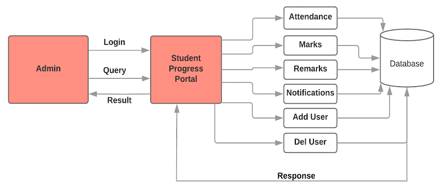
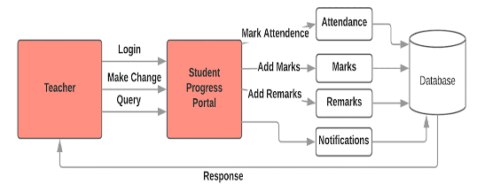
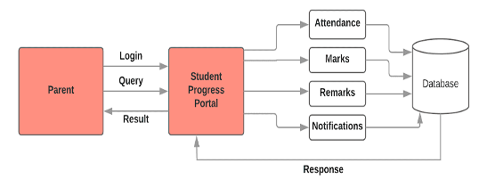

# Student Progress Portal

This is a web based portal designed for Unique Group of Institutions.

Using this portal, parents will be able to access their children’s information using a unique user name password generated for each student. The portal will include the following features to facilitate the users:

**Notifications:** Any general announcement from the teachers of the school management will be visible in this section of the web application. The notifications will be in a chronological order and a count is also given on the top. This will also act as a noticeboard tab which will update the parents on permissions required, warnings letters, notices where the parents can acknowledge/approve.

**Remarks:** The personalized messages sent by the school management or the teachers related to the student personally appear here. This can be thought of as the most important section of the portal as this is where the teachers will be sending direct messages to parents and the parents can actually know what the student progress is and what the teachers think about the students academic or non-academic standing and performance.

**Attendance:** The teachers have access to the attendance chart of all their classes as shown in the following screenshot. They can just select the class from the given drop down menu. However, only the class teachers are allowed to make changes in the attendance chart. Individual attendance is also available to parents.

**Manage Accounts (Admin):** This is an Admin-Only feature that allows user to add, edit, and remove users (teachers, admins, and parents).

**Reports:** This page gives the option of selecting/scrolling through the sessions (e.g January - March), to view the results of the respective session for a particular subject. This section illustrates individual performance of a student in terms of their test performance.

